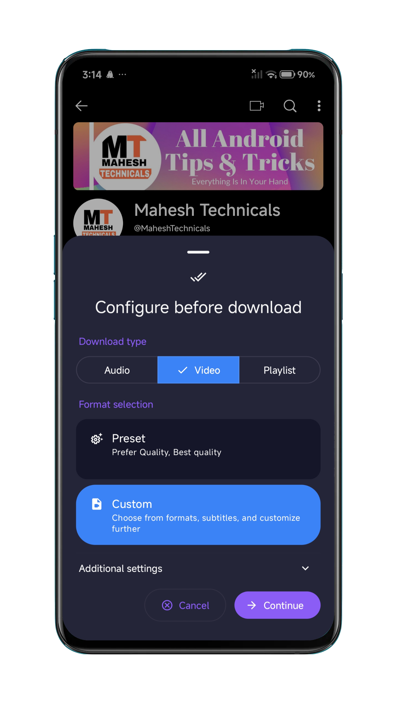
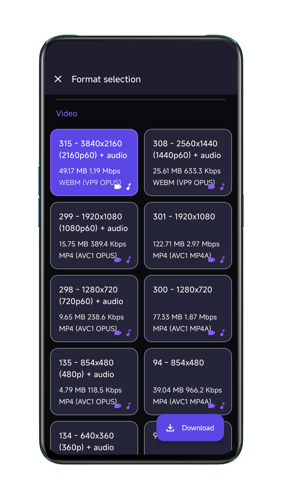
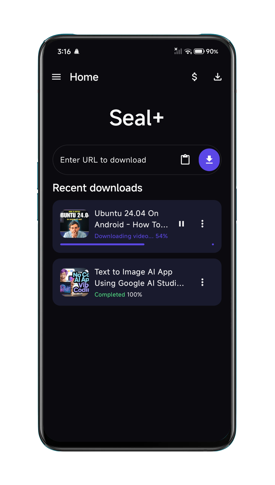
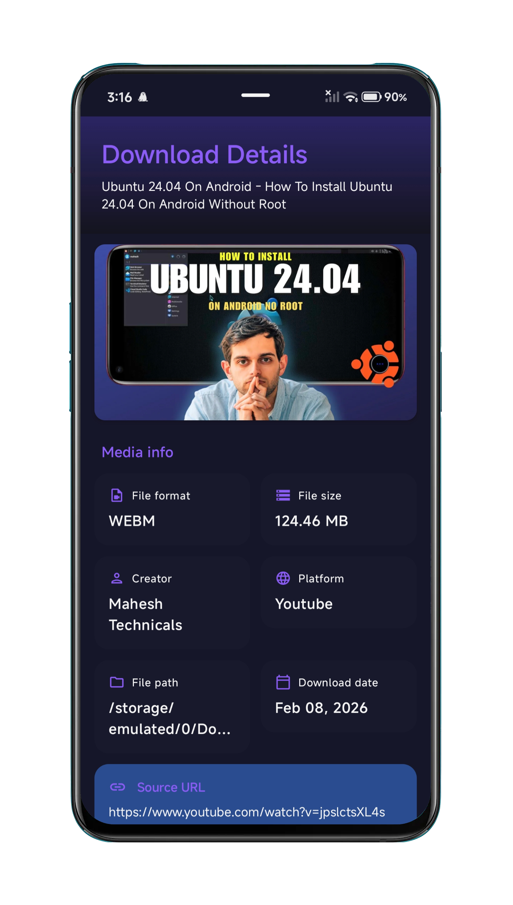
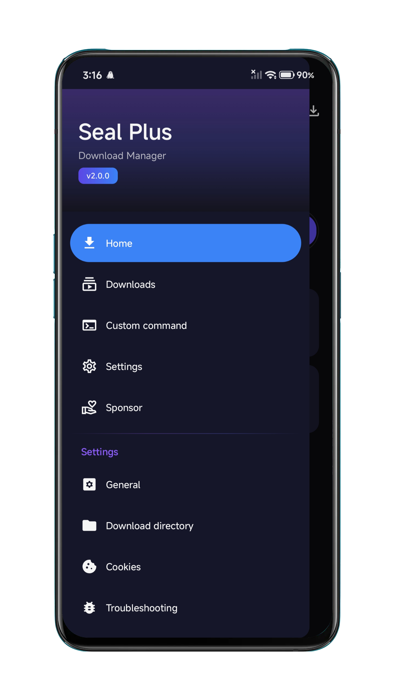
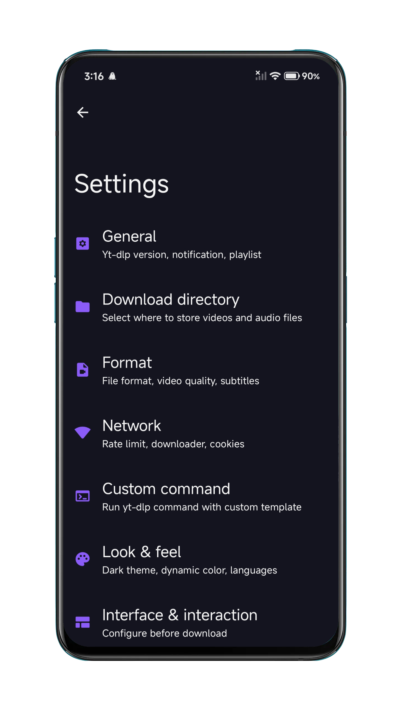
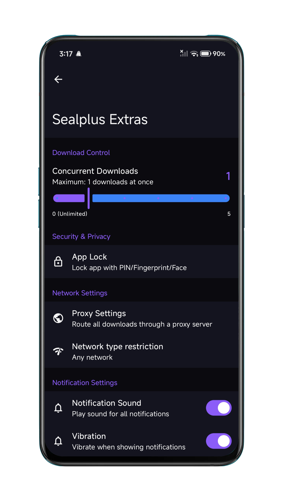
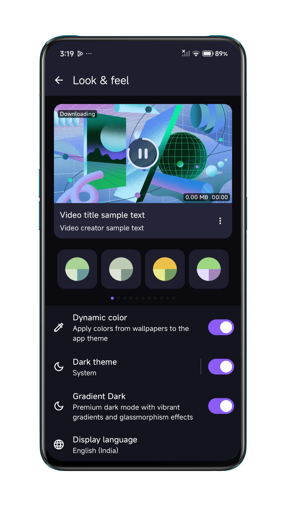
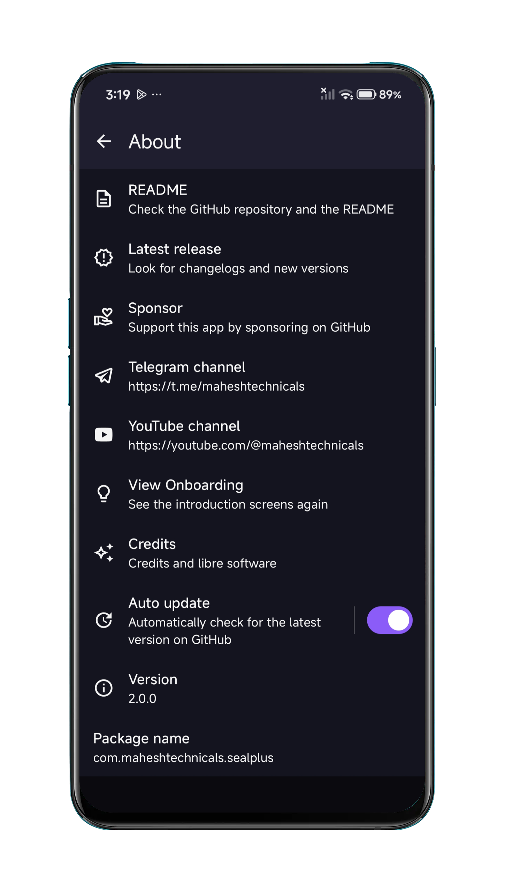

<div align="center">


# Seal Plus

### 🎬 Advanced Video/Audio Downloader for Android

[](https://github.com/MaheshTechnicals/Sealplus/releases/latest/)
[](https://github.com/MaheshTechnicals/Sealplus/releases/)
[](https://github.com/MaheshTechnicals/Sealplus/blob/main/CHANGELOG.md)
[](https://github.com/MaheshTechnicals/Sealplus/releases/)
[](https://github.com/MaheshTechnicals/Sealplus/stargazers)
[![Supported-Sites](https://img.shields.io/badge/1000%2B%20Sites-9cf?style=flat&logo=data:image/svg+xml;base64,PD94bWwgdmVyc2lvbj0iMS4wIiBlbmNvZGluZz0idXRmLTgiPz4KPHN2ZyBoZWlnaHQ9IjI0cHgiIHZpZXdCb3g9IjAgMCAyNCAyNCIgd2lkdGg9IjI0cHgiIGZpbGw9IiNGRkZGRkYiIHhtbG5zPSJodHRwOi8vd3d3LnczLm9yZy8yMDAwL3N2ZyI+CiAgPHBhdGggZD0iTTAgMGgyNHYyNEgwVjB6IiBmaWxsPSJub25lIi8+CiAgPHBhdGggZD0iTTExLjk5IDJDNi40NyAyIDIgNi40OCAyIDEyczQuNDcgMTAgOS45OSAxMEMxNy41MiAyMiAyMiAxNy41MiAyMiAxMlMxNy41MiAyIDExLjk5IDJ6bTYuOTMgNmgtMi45NWMtLjMyLTEuMjUtLjc4LTIuNDUtMS4zOC0zLjU2IDEuODQuNjMgMy4zNyAxLjkxIDQuMzMgMy41NnpNMTIgNC4wNGMuODMgMS4yIDEuNDggMi41MyAxLjkxIDMuOTZoLTMuODJjLjQzLTEuNDMgMS4wOC0yLjc2IDEuOTEtMy45NnpNNC4yNiAxNEM0LjEgMTMuMzYgNCAxMi42OSA0IDEycy4xLTEuMzYuMjYtMmgzLjM4Yy0uMDguNjYtLjE0IDEuMzItLjE0IDJzLjA2IDEuMzQuMTQgMkg0LjI2em0uODIgMmgyLjk1Yy4zMiAxLjI1Ljc4IDIuNDUgMS4zOCAzLjU2LTEuODQtLjYzLTMuMzctMS45LTQuMzMtMy41NnptMi45NS04SDUuMDhjLjk2LTEuNjYgMi40OS0yLjkzIDQuMzMtMy41NkM4LjgxIDUuNTUgOC4zNSA2Ljc1IDguMDMgOHpNMTIgMTkuOTZjLS44My0xLjItMS40OC0yLjUzLTEuOTEtMy45NmgzLjgyYy0uNDMgMS40My0xLjA4IDIuNzYtMS45MSAzLjk2ek0xNC4zNCAxNEg5LjY2Yy0uMDktLjY2LS4xNi0xLjMyLS4xNi0ycy4wNy0xLjM1LjE2LTJoNC42OGMuMDkuNjUuMTYgMS4zMi4xNiAycy0uMDcgMS4zNC0uMTYgMnptLjI1IDUuNTZjLjYtMS4xMSAxLjA2LTIuMzEgMS4zOC0zLjU2aDIuOTVjLS45NiAxLjY1LTIuNDkgMi45My00LjMzIDMuNTZ6TTE2LjM2IDE0Yy4wOC0uNjYuMTQtMS4zMi4xNC0ycy0uMDYtMS4zNC0uMTQtMmgzLjM4Yy4xNi42NC4yNiAxLjMxLjI2IDJzLS4xIDEuMzYtLjI2IDJoLTMuMzh6IiBzdHlsZT0iZmlsbDogcmdiKDE2MiwgMTk4LCAyMzQpOyIvPgo8L3N2Zz4=&label=Supported)](https://github.com/yt-dlp/yt-dlp/blob/master/supportedsites.md)
[](https://android-arsenal.com/api?level=24)
[](https://github.com/JunkFood02/Seal/blob/main/LICENSE)

**Seal Plus** is a powerful, premium video and audio downloader for Android. Built on the solid foundation of [Seal](https://github.com/JunkFood02/Seal) by [JunkFood02](https://github.com/JunkFood02), this enhanced version features exclusive premium UI themes, advanced functionality, and cutting-edge Material Design 3 implementation.

### 🌟 What Makes Seal Plus Special?

- **🎨 Exclusive Gradient Dark Theme**: Premium glassmorphism UI with vibrant gradients
- **⚡ Auto-Update System**: Seamless in-app updates from our release page
- **🎯 Enhanced Repository**: Active maintenance and improvements by [Mahesh Technicals](https://github.com/MaheshTechnicals)
- **💎 Modern Architecture**: Latest Android SDK 36, Kotlin 2.0, Jetpack Compose
- **🚀 Performance Optimized**: Hardware-accelerated animations, efficient downloads

---

### 🌍 Language Support

English
&nbsp;&nbsp;| &nbsp;&nbsp;
<a href="https://github.com/JunkFood02/Seal/blob/main/translations/README-zh_Hans.md">简体中文</a>
&nbsp;&nbsp;| &nbsp;&nbsp;
<a href="https://github.com/JunkFood02/Seal/blob/main/translations/README-zh_Hant.md">繁體中文</a>
&nbsp;&nbsp;| &nbsp;&nbsp;
<a href="https://github.com/JunkFood02/Seal/blob/main/translations/README-ar.md">العربية</a>
&nbsp;&nbsp;| &nbsp;&nbsp;
<a href="https://github.com/JunkFood02/Seal/blob/main/translations/README-pt.md">Portuguese</a>
&nbsp;&nbsp;| &nbsp;&nbsp;
<a href="https://github.com/JunkFood02/Seal/blob/main/translations/README-ua.md">Українська</a>
&nbsp;&nbsp;| &nbsp;&nbsp;
<a href="https://github.com/JunkFood02/Seal/blob/main/translations/README-th.md">ภาษาไทย</a>
&nbsp;&nbsp;| &nbsp;&nbsp;
<a href="https://github.com/JunkFood02/Seal/blob/main/translations/README-fa.md">فارسی</a>
&nbsp;&nbsp;| &nbsp;&nbsp;
<a href="https://github.com/JunkFood02/Seal/blob/main/translations/README-it.md">Italiano</a>
&nbsp;&nbsp;| &nbsp;&nbsp;
<a href="https://github.com/JunkFood02/Seal/blob/main/translations/README-ja.md">日本語</a>
&nbsp;&nbsp;| &nbsp;&nbsp;
<a href="https://github.com/JunkFood02/Seal/blob/main/translations/README-hi.md">हिंदी</a>
&nbsp;&nbsp;| &nbsp;&nbsp;
<a href="https://github.com/JunkFood02/Seal/blob/main/translations/README-bn.md">বাংলা</a>

</div>


## 📱 Screenshots

<div align="center">
<div>









</div>
</div>

<br>

## ✨ Key Features

### � Premium UI & Theming
- **Gradient Dark Theme** ⭐ *Exclusive to Seal Plus*
  - Deep charcoal/obsidian backgrounds (#0A0A0F, #14141F) perfect for OLED displays
  - Vibrant linear gradients with blues (#5B47E5) and purples (#8B5CF6)
  - Sophisticated glassmorphism effects with backdrop blur
  - Premium card-based layouts with smooth 60fps animations
  - WCAG AA compliant contrast ratios for accessibility
  - Toggle on/off in Settings → Look & Feel

- **Material Design 3**: Beautiful, modern UI
  - System-wide dynamic colors (Android 12+)
  - Dark/Light/Gradient Dark theme options
  - Smooth micro-animations and transitions
  - Premium component library

### 🎯 Core Download Capabilities
- **Universal Downloader**: Support for 1000+ platforms via [yt-dlp](https://github.com/yt-dlp/yt-dlp)
  - YouTube, Instagram, TikTok, Twitter, Facebook, Vimeo, Dailymotion
  - Reddit, Twitch, SoundCloud, Bandcamp, and many more
  - [View full list of supported sites](https://github.com/yt-dlp/yt-dlp/blob/master/supportedsites.md)
  
- **High-Quality Audio Extraction**
  - Extract audio with metadata embedding via [mutagen](https://github.com/quodlibet/mutagen)
  - Automatic thumbnail and metadata integration
  - Multiple formats: MP3, M4A, OPUS, FLAC, WAV
  - Configurable bitrate and quality settings

- **Playlist Support**: Batch download entire playlists
  - Single-click playlist downloading
  - Progress tracking for each video
  - Customizable naming schemes
  - Resume capability for interrupted downloads

### ⚡ Advanced Features
- **High-Speed Downloads**: Embedded [aria2c](https://github.com/aria2/aria2) engine
  - Multi-connection parallel downloads
  - Automatic retry on network failure
  - Resume interrupted downloads
  - Optimized for mobile networks

- **Subtitle Support**: Comprehensive subtitle handling
  - Embed subtitles directly into videos
  - Download subtitles as separate files
  - Auto-generated and manual subtitles
  - Multiple language support

- **Custom Commands**: Advanced yt-dlp command execution
  - Create and save command templates
  - Full yt-dlp CLI functionality
  - Template management system
  - Direct command-line access for power users

- **Download Manager**: Comprehensive download history
  - Track all downloads with timestamps
  - Re-download or share files easily
  - Search and filter capabilities
  - Batch operations support

### 🚀 Exclusive Seal Plus Features
- **Auto-Update System**: Seamless in-app updates
  - Automatic version checking
  - One-click APK updates
  - Changelog display before updating
  - Enabled by default for convenience

- **Enhanced Community**: Connected ecosystem
  - [YouTube Channel](https://youtube.com/@maheshtechnicals) for tutorials
  - [Telegram Community](https://t.me/maheshtechnicals) for support
  - Active development and quick bug fixes
  - Regular feature updates

### 💻 Technical Excellence
- **Pure Kotlin Architecture**: Modern Android development
  - Single Activity architecture (no fragments)
  - 100% Jetpack Compose UI
  - Clean MVVM architecture
  - Kotlin Coroutines for async operations

- **Latest Technology Stack**
  - Android SDK 36 (Android 14)
  - Kotlin 2.0.21 with K2 compiler
  - Jetpack Compose BOM 2025.01.00
  - Room Database 2.8.4
  - Material 3 Components

- **Performance Optimized**
  - Hardware-accelerated animations
  - Efficient memory management
  - Background task handling
  - Battery optimization friendly


## ⬇️ Download & Installation

### 🎉 What's New in v1.2.5?

<details>
<summary><b>📱 Click to see latest updates (January 9, 2026)</b></summary>

#### ✨ Professional Onboarding Screens
- 👋 **4 Beautiful Pages** - Welcome, Downloads, Customizable, and Security
- 🎭 **Smooth Animations** - Spring bounce, fade transitions, morphing indicators
- 👆 **Swipe Navigation** - Intuitive HorizontalPager with gesture support
- ⏩ **Skip/Back/Next Controls** - Flexible navigation through onboarding
- 🎨 **Theme Integration** - Matches Gradient Dark with floating gradient blobs
- ✨ **Glow Effects** - Beautiful icon animations with blur effects
- 🎯 **First-Time Detection** - Shows on first launch, then skips automatically
- ⚙️ **Settings Access** - "View Onboarding" option in About page
- 📱 **Material Design 3** - Professional UI following latest guidelines

#### 🎨 Elegant Splash Screen
- 🚀 **Animated Logo** - Spring bounce animation with smooth scaling
- 🌈 **Gradient Branding** - Pulsing glow effect with app theme colors
- 🌓 **Theme-Aware** - Adapts to Gradient Dark and light themes
- ⏱️ **Professional Timing** - 2.4s optimal display duration
- 💼 **Custom Branding** - Powered by Mahesh Technicals

#### 🐛 Bug Fixes
- 🌐 **Network Download Fix** - Fixed "Any Network" option not allowing mobile data
- ✅ **Improved Detection** - Better network availability checks in downloads

#### Previous Updates (v1.2.4, v1.2.3, v1.2.1)
- 🌐 **Network Type Restrictions** - Download on WiFi/Mobile/Any network
- 🔔 **Smart Notifications** - Customizable sounds, vibration, and LED
- ✨ **New App Logo** - Refreshed icon with modern Seal Plus branding
- 🚀 **Auto-Update System** - Seamless in-app updates enabled by default
- 🎨 **Gradient Dark Theme** - Premium glassmorphism UI
- 🎯 **Repository Migration** - All updates from MaheshTechnicals/Sealplus
- 💬 **Community Links** - YouTube and Telegram channels integrated

[View Full Changelog →](https://github.com/MaheshTechnicals/Sealplus/blob/main/CHANGELOG.md)
</details>

### 📦 Recommended Installation

For most Android devices, install the **arm64-v8a** version for optimal performance.

### 🚀 Latest Releases

- **Latest Stable**: [Download from GitHub Releases](https://github.com/MaheshTechnicals/Sealplus/releases/latest)
  - ✅ **Current Version**: v1.2.5 (January 2026)
  - ✨ Professional onboarding screens with smooth animations
  - 🎨 Elegant splash screen with gradient branding
  - 🔒 App Lock with PIN & Biometric authentication
  - 🌐 Network type restrictions (WiFi/Mobile/Any) - Fixed!
  - 🔔 Smart notifications with customization
  - 🎨 Gradient Dark theme with glassmorphism
  - 🚀 Auto-update system enabled by default

- **Preview Builds**: [Download Pre-release Versions](https://github.com/MaheshTechnicals/Sealplus/releases) 
  - 🧪 Test cutting-edge features
  - 🐛 Help us identify and fix bugs
  - 📢 Early access to new functionality

### 📱 Device Compatibility

| Requirement | Specification |
|------------|---------------|
| **Minimum Android** | Android 7.0 (API 24) |
| **Target Android** | Android 14 (API 36) |
| **Current Version** | 1.2.5 |
| **Release Date** | January 8, 2026 |

### 🏗️ Architecture Support

- ✅ **arm64-v8a** (Recommended for most modern devices)
- ✅ **armeabi-v7a** (Older 32-bit ARM devices)
- ✅ **x86_64** (Intel/AMD 64-bit devices)
- ✅ **x86** (Older Intel/AMD 32-bit devices)

### 📋 Installation Instructions

1. **Download** the appropriate APK for your device architecture from [Releases](https://github.com/MaheshTechnicals/Sealplus/releases/latest)
2. **Enable** "Install from unknown sources" in Settings → Security
3. **Open** the downloaded APK file
4. **Follow** the installation prompts
5. **Grant** necessary permissions when launching the app
6. **Enjoy** seamless downloads!

> [!TIP]
> **Auto-Update Feature**: Once installed, Seal Plus will automatically check for updates. You'll be notified when new versions are available and can update with one click!

> [!WARNING]
> **Security Notice**: Always download Seal Plus exclusively from our [official GitHub releases page](https://github.com/MaheshTechnicals/Sealplus/releases). Never download from third-party sources to ensure you're getting the authentic, safe version.

---

## ❓ Frequently Asked Questions

<details>
<summary><b>📱 How do I enable Gradient Dark theme?</b></summary>

1. Open **Settings**
2. Go to **Look & Feel**
3. Enable **Dark Theme** (if not already on)
4. Toggle **Gradient Dark** switch
5. Enjoy the premium glassmorphism UI!

The theme features deep backgrounds with vibrant blue-purple gradients and smooth animations.
</details>

<details>
<summary><b>🔄 How does auto-update work?</b></summary>

Seal Plus automatically checks for updates from our GitHub releases:
- Enabled by default for all installations
- Checks when you open the app (not intrusive)
- Shows changelog before updating
- One-click download and install
- Can be disabled in Settings → About → Auto update

No need to manually check for updates anymore!
</details>

<details>
<summary><b>📥 Which architecture should I download?</b></summary>

| Architecture | Recommended For |
|--------------|-----------------|
| **arm64-v8a** | Most modern Android phones (2017+) - **Recommended** |
| **armeabi-v7a** | Older phones (2011-2017) |
| **x86_64** | Intel/AMD based devices, emulators |
| **x86** | Older Intel/AMD devices |
| **universal** | Works on all devices (larger file size) |

**Don't know?** Download the **universal** APK - it works on all devices!
</details>

<details>
<summary><b>🌍 Can I use this to download from any website?</b></summary>

Seal Plus supports **1000+ platforms** via yt-dlp, including:
- ✅ YouTube, YouTube Music
- ✅ Instagram, TikTok, Twitter/X
- ✅ Facebook, Reddit, Vimeo
- ✅ Twitch, SoundCloud, Bandcamp
- ✅ Dailymotion, Bilibili, and many more!

[View complete list →](https://github.com/yt-dlp/yt-dlp/blob/master/supportedsites.md)
</details>

<details>
<summary><b>🎵 Can I extract only audio from videos?</b></summary>

Yes! Seal Plus has excellent audio extraction:
- Toggle "Save as audio" option
- Choose format (MP3, M4A, OPUS, etc.)
- Automatic metadata embedding
- Album art/thumbnail included
- Customizable quality settings

Perfect for music downloads and podcasts!
</details>

<details>
<summary><b>🔧 What's the difference between General and Custom Command modes?</b></summary>

**General Mode** (Easy):
- User-friendly interface
- Pre-configured options
- Automatic file organization
- Best for most users

**Custom Command Mode** (Advanced):
- Full yt-dlp CLI access
- Create and save templates
- Advanced configurations
- Terminal-like control

Choose based on your comfort level!
</details>

<details>
<summary><b>🔐 Is Seal Plus safe? Does it collect my data?</b></summary>

**Absolutely safe!**
- ✅ 100% open-source (view all code)
- ✅ No data collection or analytics
- ✅ No ads or trackers
- ✅ No internet permissions except for downloads
- ✅ All processing done locally on your device
- ✅ Licensed under GPL-3.0

You can verify everything in the [source code](https://github.com/MaheshTechnicals/Sealplus).
</details>

<details>
<summary><b>📱 What's the difference between Seal and Seal Plus?</b></summary>

**Seal Plus** is an enhanced fork with:
- 🎨 **Exclusive Gradient Dark Theme** with glassmorphism
- 🚀 **Auto-update system** enabled by default
- 📺 **Enhanced community** (YouTube, Telegram)
- 🔧 **Additional UI improvements** and optimizations
- 🎯 **Active maintenance** by Mahesh Technicals
- 🏆 **Latest tech stack** (Kotlin 2.0, Compose 2025, SDK 36)

Both are free and open-source!
</details>

<details>
<summary><b>❌ I'm getting download errors. What should I do?</b></summary>

Try these solutions:
1. **Update yt-dlp**: Settings → About → Update yt-dlp
2. **Check internet**: Ensure stable connection
3. **Clear cache**: Settings → Storage → Clear cache
4. **Try custom command**: Some sites need specific parameters
5. **Check site support**: Visit [supported sites list](https://github.com/yt-dlp/yt-dlp/blob/master/supportedsites.md)
6. **Report issue**: [GitHub Issues](https://github.com/MaheshTechnicals/Sealplus/issues) with details

Most issues are resolved by updating yt-dlp!
</details>

---

## 💬 Community & Support

### 🌐 Join Our Community

Stay connected with the Seal Plus community and get support:

- **📺 YouTube Channel**: [Mahesh Technicals](https://youtube.com/@maheshtechnicals)
  - Video tutorials and feature demonstrations
  - Tips and tricks for advanced usage
  - Update announcements and previews

- **💬 Telegram Channel**: [Join @maheshtechnicals](https://t.me/maheshtechnicals)
  - Latest updates and announcements
  - Quick community support
  - Direct developer interaction
  - Beta testing opportunities

### 🐛 Bug Reports & Feature Requests

We value your feedback! Help us improve Seal Plus:

1. **Check First**: Browse [existing issues](https://github.com/MaheshTechnicals/Sealplus/issues) to avoid duplicates
2. **Read Guidelines**: Review our [Contributing Guidelines](https://github.com/MaheshTechnicals/Sealplus/blob/main/CONTRIBUTING.md)
3. **Report Issues**: Open a [new issue](https://github.com/MaheshTechnicals/Sealplus/issues/new) with:
   - Clear description of the problem/feature
   - Steps to reproduce (for bugs)
   - Your device model and Android version
   - App version and build variant
   - Screenshots or screen recordings (if applicable)

### 📖 Documentation & Resources

- **📋 Changelog**: [View all changes and updates](https://github.com/MaheshTechnicals/Sealplus/blob/main/CHANGELOG.md)
- **🌍 Supported Sites**: [Full list of 1000+ supported platforms](https://github.com/yt-dlp/yt-dlp/blob/master/supportedsites.md)
- **🎨 Gradient Dark Theme**: [Complete documentation](https://github.com/MaheshTechnicals/Sealplus/blob/main/GRADIENT_DARK_README.md)
- **📖 Contributing Guide**: [How to contribute](https://github.com/MaheshTechnicals/Sealplus/blob/main/CONTRIBUTING.md)

## 💖 Support Seal Plus

### ❤️ Show Your Support

Seal Plus is **100% free and open-source** software, built with passion by the community. Here's how you can help:

| Action | Impact |
|--------|--------|
| ⭐ **Star this repo** | Help others discover Seal Plus |
| 📺 **Subscribe on YouTube** | Get tutorials and update notifications |
| 💬 **Join Telegram** | Connect with the community |
| 🐛 **Report bugs** | Help us fix issues faster |
| 💡 **Suggest features** | Shape the future of Seal Plus |
| 🌍 **Translate** | Make it accessible worldwide |
| 📢 **Share** | Tell your friends about Seal Plus |

### 🎉 Special Thanks

A huge thank you to:
- **[JunkFood02](https://github.com/JunkFood02)** and all [original Seal contributors](https://github.com/JunkFood02/Seal/graphs/contributors)
- **All sponsors** supporting the original Seal project
- **Our community members** providing feedback and bug reports
- **Translators** making Seal Plus accessible worldwide
- **Everyone** who has starred, shared, or used Seal Plus

Your contributions and support make this project possible! 🙏

## 🤝 Contributing to Seal Plus

We welcome all contributions! Whether you're a developer, designer, translator, or user, there's a way for you to help.

### 🌍 Translations

Help make Seal Plus accessible to users worldwide:

- **Contribute**: Visit [Hosted Weblate](https://hosted.weblate.org/projects/seal/) to add or improve translations
- **Current Status**: 

[](https://hosted.weblate.org/engage/seal/)

### 💻 Code Contributions

#### Getting Started
1. **Fork** the repository
2. **Clone** your fork: `git clone https://github.com/YOUR_USERNAME/Seal.git`
3. **Create** a feature branch: `git checkout -b feature/amazing-feature`
4. **Make** your changes
5. **Test** thoroughly on multiple devices
6. **Commit** with clear messages: `git commit -m "Add amazing feature"`
7. **Push** to your fork: `git push origin feature/amazing-feature`
8. **Open** a Pull Request with detailed description

#### Development Environment
```bash
# Requirements
- Android Studio Ladybug or later
- JDK 17 or later
- Android SDK 24-36
- Gradle 8.13+

# Build
./gradlew assembleRelease

# Debug Build
./gradlew assembleDebug
```

### 📋 Contribution Guidelines

> [!IMPORTANT]
> Before contributing, please read our [Contributing Guidelines](https://github.com/MaheshTechnicals/Sealplus/blob/main/CONTRIBUTING.md) for:
> - Code style standards
> - Commit message conventions
> - Pull request requirements
> - Feature request process
> - Bug report templates

### 🏗️ Technology Stack

| Component | Technology | Version |
|-----------|-----------|---------|
| **Language** | Kotlin | 2.0.21 |
| **UI Framework** | Jetpack Compose | 2025.01.00 |
| **Architecture** | MVVM + Clean Architecture | - |
| **Build System** | Gradle (KTS) | 8.13 |
| **Minimum SDK** | Android 7.0 | API 24 |
| **Target SDK** | Android 14 | API 36 |
| **Database** | Room | 2.8.4 |
| **Async** | Kotlin Coroutines | 1.10.1 |
| **Networking** | OkHttp | 5.0.0 |
| **Image Loading** | Coil | 2.7.0 |
| **DI** | Manual (Performance) | - |

## ⭐ Star History

Watch how our community has grown over time!

[](https://star-history.com/#MaheshTechnicals/Sealplus&Timeline)

---

## 🙏 Acknowledgments & Credits

Seal Plus stands on the shoulders of giants. We're grateful to these amazing open-source projects and contributors:

### 🏆 Core Technologies

| Project | Description | License |
|---------|-------------|---------|
| **[yt-dlp](https://github.com/yt-dlp/yt-dlp)** | Powerful video downloader engine | Unlicense |
| **[youtubedl-android](https://github.com/yausername/youtubedl-android)** | Android wrapper for yt-dlp | GPL-3.0 |
| **[aria2](https://github.com/aria2/aria2)** | High-speed download utility | GPL-2.0 |
| **[mutagen](https://github.com/quodlibet/mutagen)** | Audio metadata handler | GPL-2.0 |

### 🎨 Design & UI Inspiration

| Project | Inspiration | Author |
|---------|-------------|--------|
| **[Seal](https://github.com/JunkFood02/Seal)** | Original foundation | [JunkFood02](https://github.com/JunkFood02) |
| **[Read You](https://github.com/Ashinch/ReadYou)** | UI patterns & components | [Ashinch](https://github.com/Ashinch) |
| **[Music You](https://github.com/Kyant0/MusicYou)** | Design aesthetic | [Kyant0](https://github.com/Kyant0) |
| **[dvd](https://github.com/yausername/dvd)** | Additional utilities | [yausername](https://github.com/yausername) |

### 🌈 Material Design System

| Library | Purpose |
|---------|---------|
| **[Material Color Utilities](https://github.com/material-foundation/material-color-utilities)** | Dynamic color theming |
| **[Monet](https://github.com/Kyant0/Monet)** | Color scheme generation |
| **[Material 3 Components](https://m3.material.io/)** | Modern UI components |

### 🎯 Seal Plus Exclusive Features

**Gradient Dark Theme** - Premium UI mode with glassmorphism effects
- Designed and implemented by [Mahesh Technicals](https://github.com/MaheshTechnicals)
- 21 new resource files and components
- 2,200+ lines of documentation
- [View Implementation Guide](https://github.com/MaheshTechnicals/Sealplus/blob/main/GRADIENT_DARK_IMPLEMENTATION_GUIDE.md)

### 🌟 Original Creator

**[JunkFood02](https://github.com/JunkFood02)** - Creator of the original Seal project
- Thank you for building an amazing foundation
- Seal Plus is an enhanced fork with additional features
- All [original contributors](https://github.com/JunkFood02/Seal/graphs/contributors) deserve recognition

### 🌍 Community Contributors

- **Translators** on [Weblate](https://hosted.weblate.org/projects/seal/) - Making Seal Plus accessible worldwide
- **Beta Testers** - Helping us catch bugs early
- **Issue Reporters** - Providing valuable feedback
- **Feature Suggesters** - Shaping the roadmap
- **All Contributors** to [Seal Plus](https://github.com/MaheshTechnicals/Sealplus/graphs/contributors)

### 💝 Special Recognition

This project wouldn't be possible without the collective efforts of the open-source community. Every contribution, no matter how small, makes a difference. Thank you all! 🙏

## 📃 License

[](https://github.com/MaheshTechnicals/Sealplus/blob/main/LICENSE)

>[!Warning]
>
>Except for the source code licensed under the GPLv3 license,
>all other parties are prohibited from using Seal's name as a downloader app,
>and the same is true for Seal's derivatives.
>Derivatives include but are not limited to forks and unofficial builds.

<div align="right">
<table><td>
<a href="#start-of-content">👆 Scroll to top</a>
</td></table>
</div>
